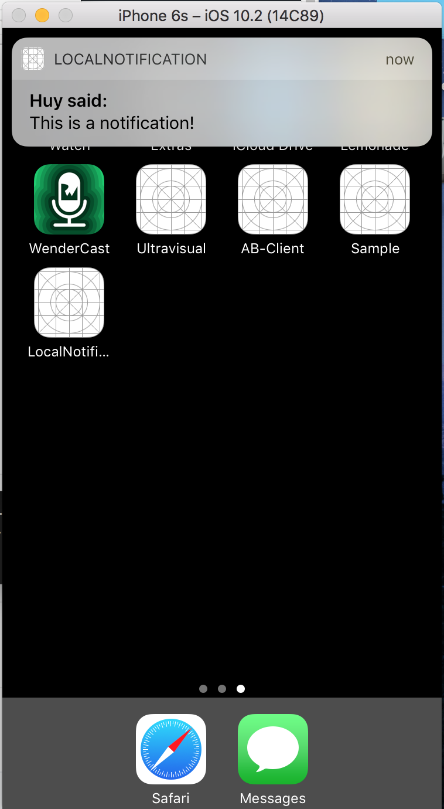

Local Notification
==========
To a user, a local notification looks the same as a push notification. However, the notifications are generated from the app, not a server. They are typically used for scheduled events, like an alarm clock or a to do item reminder.

## Screenshots

---
Source: [Local Notifications](https://github.com/codepath/ios_guides/wiki/Local-Notifications)
(This tutorial is out of date.)

With updated from:
[UILocalNotification is deprecated in iOS10](https://stackoverflow.com/questions/37938771/uilocalnotification-is-deprecated-in-ios10)
